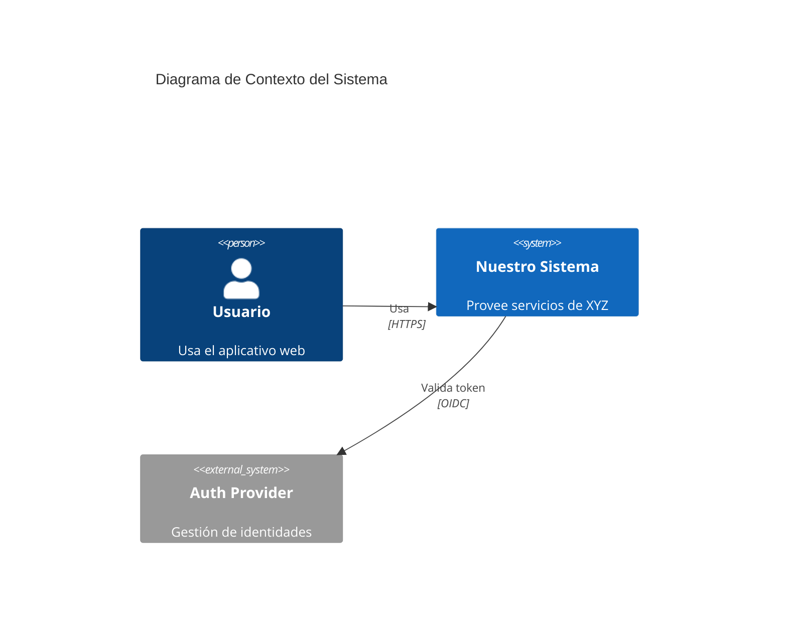
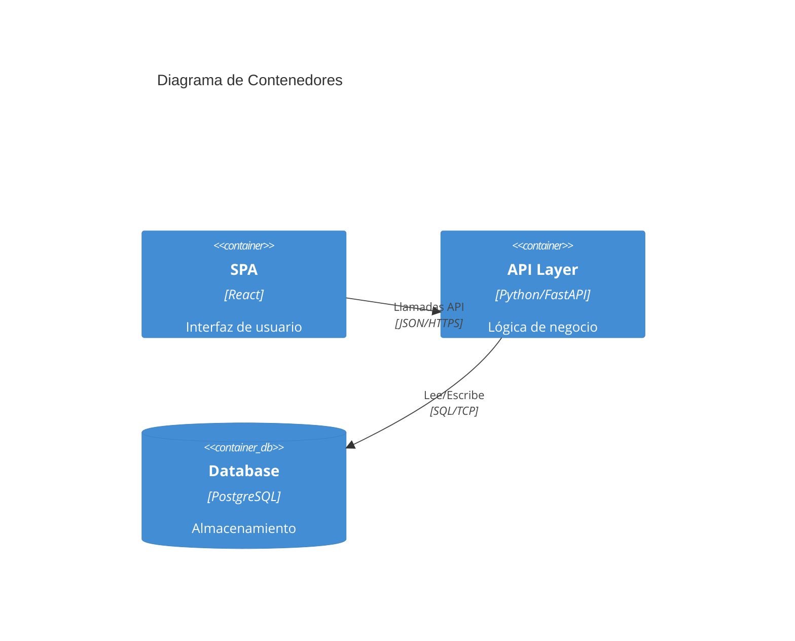
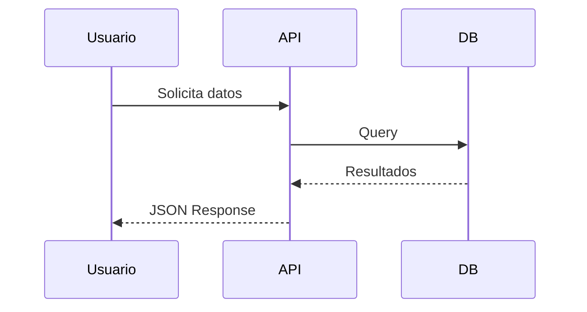

# Arquitectura del Proyecto

Todo proyecto debe tener un archivo `ARCHITECTURE.md` que podría estar en la raíz del proyecto o en una carpeta `docs/architecture/` que explique cómo funciona el sistema internamente, qué componentes tiene, y cómo se comunican entre ellos.

## ¿Qué incluir?

`Se recomienda` el uso de diagramas, ya sean ficheros .png o .svg, o diagramas **Mermaid** para ilustrar los conceptos y que sean fáciles de entender.
> [!NOTE]
> A continuación se muestran algunos ejemplos de diagramas mermaid que puedes usar:

### 1. Diagrama de Contexto (C4 Nivel 1)
Muestra cómo el sistema interactúa con usuarios y otros sistemas externos.



### 2. Diagrama de Contenedores (C4 Nivel 2)
Muestra las aplicaciones, servicios de datos y microservicios.



### 3. Diagrama de Secuencia
Para explicar flujos complejos específicos.



## Plantilla Sugerida

Puedes copiar el siguiente contenido a tu `ARCHITECTURE.md`:

```markdown
# Project Architecture

## Overview
Descripción de alto nivel...

Podrías explicar el propósito del proyecto, las principales funcionalidades y cómo se relacionan entre sí.

## Components Diagram
(Insertar diagrama Mermaid aquí)

Podrías explicar los componentes principales del sistema y cómo se relacionan entre sí.

## Technologies
Podrías listar las tecnologías principales que se usan en el proyecto.

- Backend: ...
- Frontend: ...
- Base de Datos: ...

## Design Decisions
Podrías explicar las decisiones de diseño que se tomaron para el proyecto.

- Decision 1: ...
- Decision 2: ...
```
