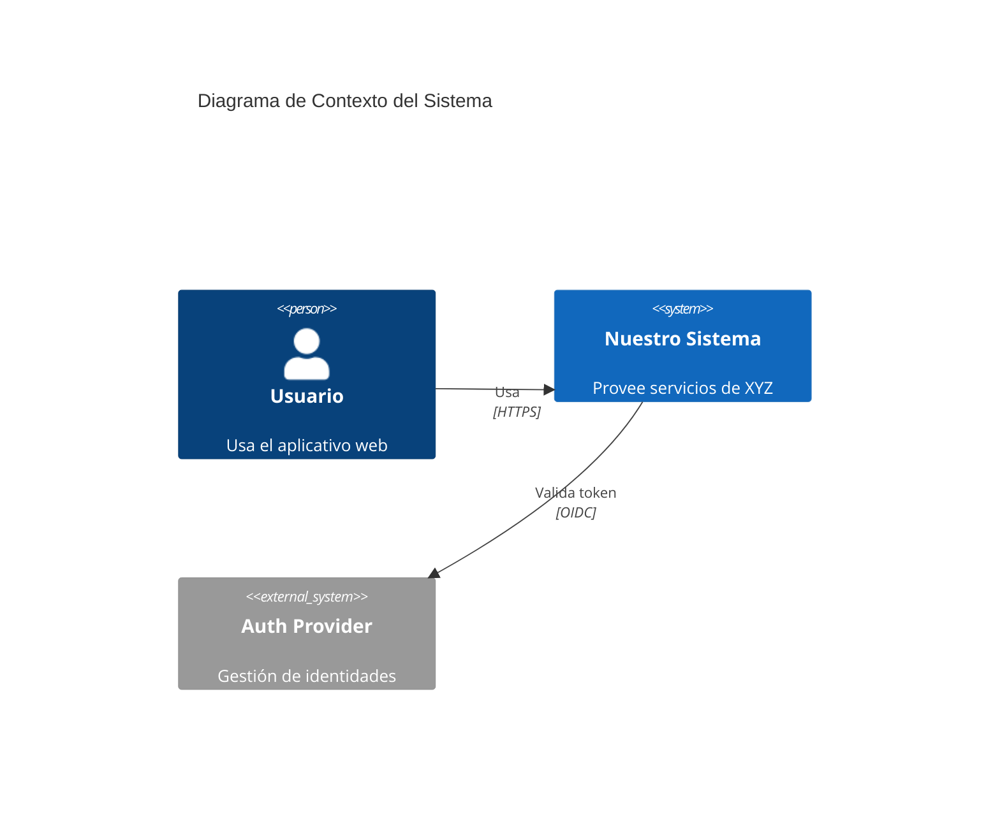
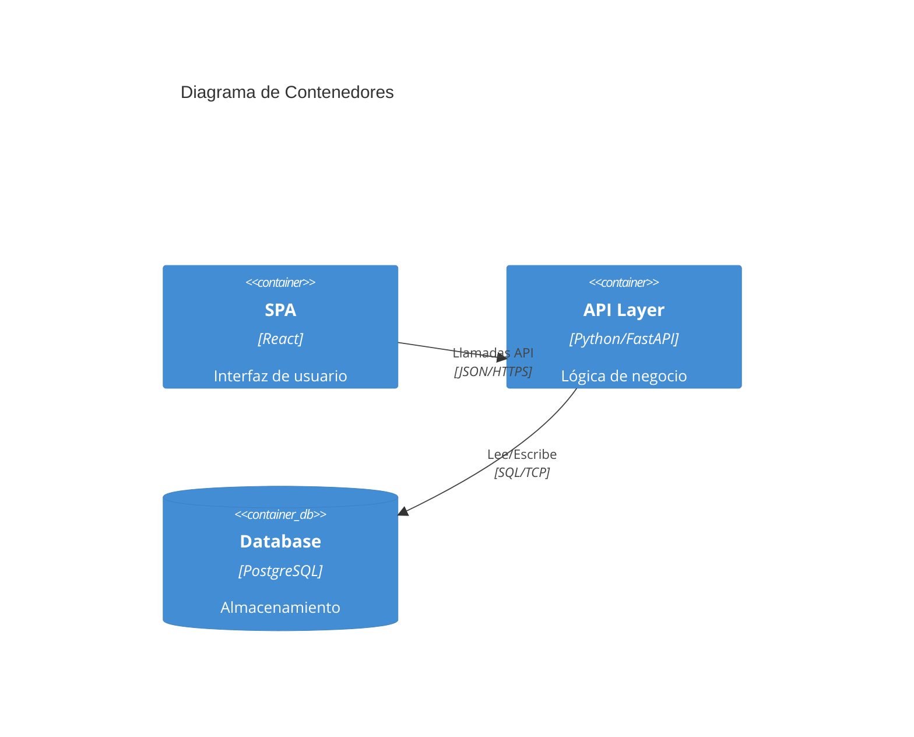
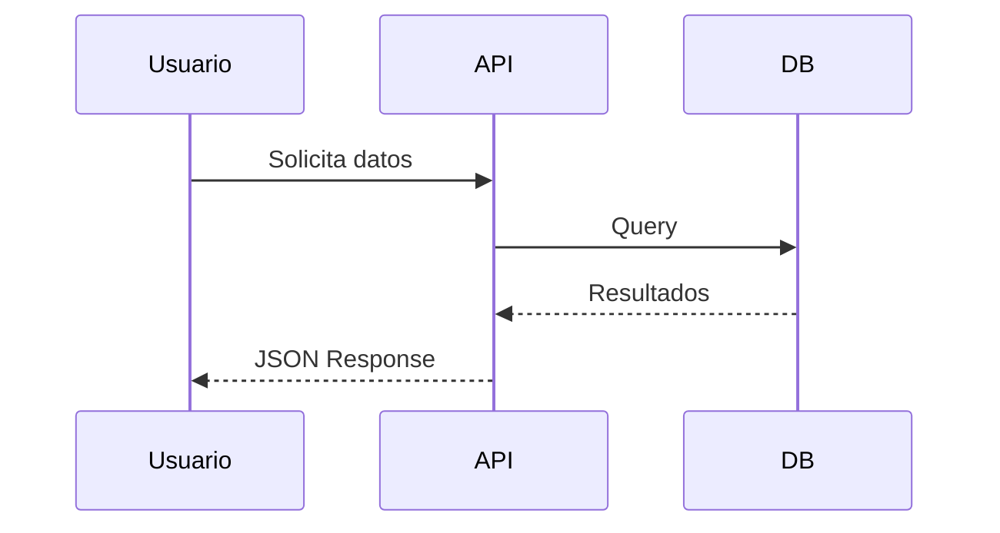

# Arquitectura del Proyecto

Todo proyecto debe tener un archivo `ARCHITECTURE.md` (o una carpeta `docs/architecture/`) que explique cómo funciona el sistema internamente.

## ¿Qué incluir?

Se recomienda encarecidamente el uso de diagramas **Mermaid** para ilustrar los conceptos.

### 1. Diagrama de Contexto (C4 Nivel 1)
Muestra cómo el sistema interactúa con usuarios y otros sistemas externos.



### 2. Diagrama de Contenedores (C4 Nivel 2)
Muestra las aplicaciones, servicios de datos y microservicios.



### 3. Diagrama de Secuencia
Para explicar flujos complejos específicos.



## Plantilla Sugerida

Puedes copiar el siguiente contenido a tu `ARCHITECTURE.md`:

```markdown
# Arquitectura del Proyecto

## Visión General
Descripción de alto nivel...

## Diagrama de Componentes
(Insertar diagrama Mermaid aquí)

## Tecnologías
- Backend: ...
- Frontend: ...
- Base de Datos: ...

## Flujos de Datos Clave
Explicación de cómo viaja la información...

## Decisiones de Diseño (ADRs)
- Decisión 1: ...
- Decisión 2: ...
```
