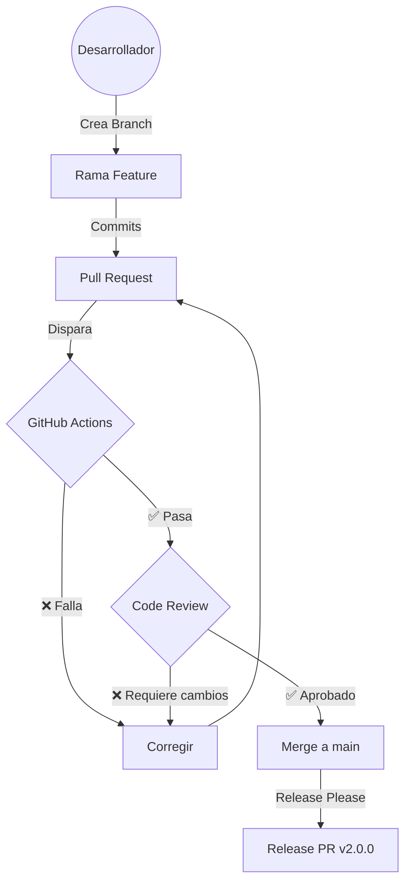

# Guía de Protección de Ramas

Esta guía explica cómo proteger la rama `main` en tu repositorio de GitHub.

## Pasos para Proteger la Rama `main`

### 1. Acceder a la Configuración

1. Ve a tu repositorio en GitHub
2. Haz clic en **Settings** (Configuración)
3. En el menú lateral, selecciona **Branches**

### 2. Añadir Regla de Protección

1. En la sección "Branch protection rules", haz clic en **Add rule** (o **Add branch ruleset** si usas la nueva interfaz)
2. En "Branch name pattern", escribe: `main`

### 3. Configuración Recomendada

Marca las siguientes opciones:

#### ✅ Require a pull request before merging
Obliga a que todos los cambios pasen por un Pull Request.

- **Require approvals**: 1 (mínimo)
- **Dismiss stale pull request approvals when new commits are pushed**: Activado
- **Require review from Code Owners**: Opcional

#### ✅ Require status checks to pass before merging
Asegura que el CI pase antes de poder mergear.

- **Require branches to be up to date before merging**: Activado
- Busca y añade status checks, estos son algunos de ejemplo:
  - `Lint`
  - `Build`
  - `Test`

#### ✅ Require conversation resolution before merging
Obliga a resolver todos los comentarios de revisión.

#### ✅ Require signed commits (Opcional)
Requiere que los commits estén firmados con GPG.

#### ❌ Allow force pushes
**Desactivado** - Nunca permitir force push a main.

#### ❌ Allow deletions
**Desactivado** - Proteger contra eliminación accidental.

### 4. Guardar Cambios

Haz clic en **Create** o **Save changes**.

## Resultado Esperado

Después de configurar la protección:

- 🚫 No se podrá hacer push directo a `main`
- ✅ Todos los cambios requieren un PR
- ✅ Al menos 1 aprobación es necesaria
- ✅ El CI debe pasar antes de mergear
- ✅ Los comentarios deben estar resueltos

## Diagrama de Flujo

```

```

## Próximos Pasos

Después de proteger la rama, consulta:
- [Conventional Commits](./CONVENTIONAL_COMMITS.md) - Formato de mensajes de commit
- [Release Workflow](./RELEASE_WORKFLOW.md) - Cómo funcionan las releases automáticas
