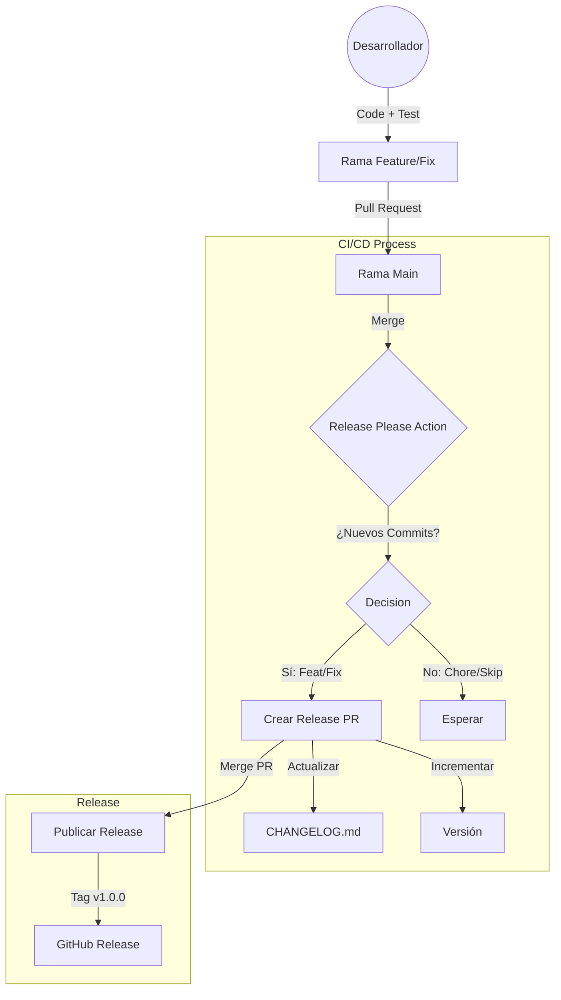

# Flujo de Releases y CI/CD

Esta guía explica conceptualmente cómo funcionan las releases automáticas y el CI/CD en la organización, utilizando **release-please** como motor de versionado.

## Diagrama de Flujo (Release)



## Arquitectura del Pipeline

El pipeline de CI/CD debe ser configurado por cada proyecto, pero generalmente sigue estos principios:

1.  **Integración Continua (CI)**:
    - Se ejecuta en cada Pull Request.
    - Corre tests unitarios, linting y checks de seguridad.
    - *Herramientas sugeridas*: GitHub Actions, Jenkins.

2.  **Despliegue Continuo (CD) - Pre-producción**:
    - Se ejecuta al mergear a ramas de desarrollo o staging.
    - Despliega automáticamente a `Apolo_Dev`.

3.  **Gestión de Versiones (Release Please)**:
    - Analiza tus commits en `main`.
    - Si encuentra commits con prefijos `feat:` o `fix:`, prepara una nueva versión.
    - Mantiene el `CHANGELOG.md` limpio y ordenado.

## Historial de Cambios (CHANGELOG)

Mantener un changelog es **obligatorio** en los proyectos de la organización. Puedes hacerlo de dos formas:

### Opción A: Automática (Recomendada)
Usando la configuración incluida en este template (`.github/workflows/release-please.yml`).
Solo necesitas seguir [Conventional Commits](CONVENTIONAL_COMMITS.md).

### Opción B: Manual
Si decides no usar automatización, debes editar `CHANGELOG.md` manualmente.

> [!TIP]
> Incluso si mantienes el changelog manualmente, **se recomienda fuertemente usar Conventional Commits**. Esto mantiene el historial limpio, facilita la trazabilidad y permite automatizar en el futuro si cambias de opinión.

## ⚙️ Archivos de Configuración

Este template incluye archivos críticos para la automatización. A continuación se explica su propósito y cuándo modificarlos.

### 1. Motor de Automatización (`.github/workflows/release-please.yml`)
- **Propósito**: Es el "cerebro" que ejecuta `release-please` en GitHub Actions.
- **¿Se debe editar?**: ❌ **No**. Generalmente no necesitas tocar esto a menos que quieras cambiar la versión de la acción o permisos.
- **Funcionamiento**: Se activa en cada push a `main`. Analiza commits, crea PRs de release y publica releases.

### 2. Mapeo de Versiones (`.github/release-please-config.json`)
- **Propósito**: Define **qué** se está versionando y **dónde** está el changelog.
- **¿Se debe editar?**: ✅ **Sí**.
- **Configuración Clave**:
  ```json
  {
    "packages": {
      ".": { // "." significa la raíz del repo
        "release-type": "simple", // Tipo de versionado (simple, node, python...)
        "changelog-path": "CHANGELOG.md" // Dónde escribir los cambios
      }
    }
  }
  ```
- **Nota**: Si tienes un monorepo (múltiples librerías separadas), aquí es donde configuras cada carpeta por separado.

### 3. Calidad de Código Local (`.pre-commit-config.yaml`)
- **Propósito**: Ejecuta verificaciones **en tu ordenador** antes de que hagas commit.
- **¿Se debe editar?**: ✅ **Sí**, para añadir reglas (linters, formatters).
- **Regla Incluida**: `conventional-pre-commit` asegura que tus mensajes de commit cumplan el formato Conventional Commits, evitando errores en el CI.

---

## 📝 Plantillas de Colaboración

### Pull Request Template (`.github/PULL_REQUEST_TEMPLATE.md`)
- **Propósito**: Aparece automáticamente cuando alguien crea una PR. Guía al desarrollador para que no olvide tests, descripción o actualizaciones de docs.
- **Personalización**: Puedes editar este archivo Markdown para añadir checklist específicos de tu equipo (ej: "¿Has actualizado Swagger?", "¿Revisado por Seguridad?").

## Referencias

- [Documentación oficial de release-please](https://github.com/googleapis/release-please)
