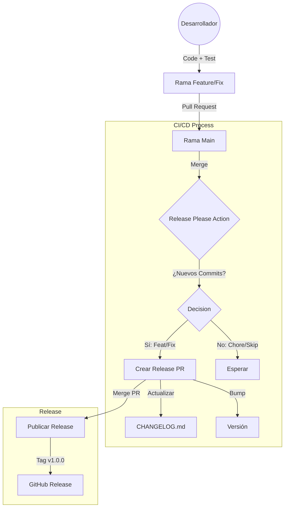

# Flujo de Releases y CI/CD

Esta guía explica conceptualmente cómo funcionan las releases automáticas y el CI/CD en la organización, utilizando **release-please** como motor de versionado.

## Diagrama de Flujo (Release)

## Arquitectura del Pipeline

El pipeline de CI/CD debe ser configurado por cada proyecto, pero generalmente sigue estos principios:

1.  **Integración Continua (CI)**:
    - Se ejecuta en cada Pull Request.
    - Corre tests unitarios, linting y checks de seguridad.
    - *Herramientas sugeridas*: GitHub Actions, Jenkins.

2.  **Despliegue Continuo (CD) - Pre-producción**:
    - Se ejecuta al mergear a ramas de desarrollo o staging.
    - Despliega automáticamente a `Apolo_Dev`.

3.  **Gestión de Versiones (Release Please)**:
    - Analiza tus commits en `main`.
    - Si encuentra commits con prefijos `feat:` o `fix:`, prepara una nueva versión.
    - Mantiene el `CHANGELOG.md` limpio y ordenado.

## Historial de Cambios (CHANGELOG)

Mantener un changelog es **obligatorio**. Puedes hacerlo de dos formas:

### Opción A: Automática (Recomendada)
Usando la configuración incluida en este template (`.github/workflows/release-please.yml`).
Solo necesitas seguir [Conventional Commits](CONVENTIONAL_COMMITS.md).

### Opción B: Manual
Si decides no usar automatización, debes editar `CHANGELOG.md` manualmente antes de cada release, siguiendo estrictamente el formato [Keep a Changelog](https://keepachangelog.com/).

## Referencias

- [Documentación oficial de release-please](https://github.com/googleapis/release-please)
